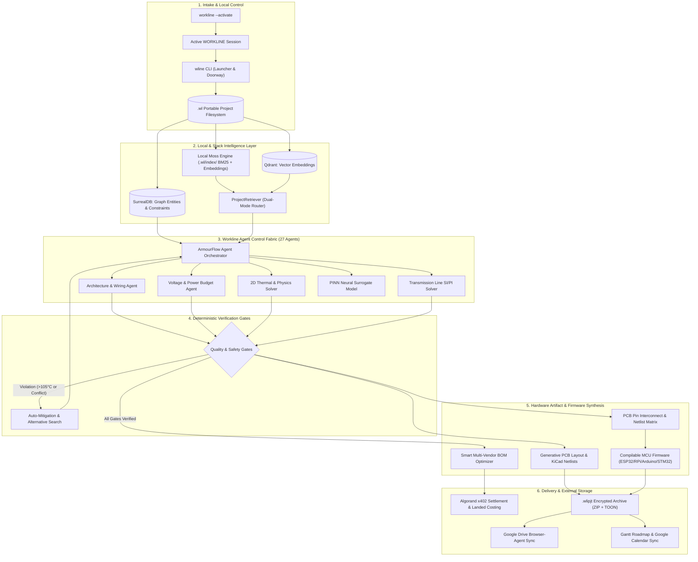

<div align="center">

# ⚡ WORKLINE
### Local-First Autonomous Engineering Platform & Intelligence Runtime

[](https://python.org)
[](https://fastapi.tiangolo.com)
[-black?logo=next.js&logoColor=white)](https://nextjs.org)
[](https://www.typescriptlang.org)
[](https://surrealdb.com)
[](https://qdrant.tech)
[](https://aws.amazon.com)
[](LICENSE)

<p align="center">
  <b>Workline</b> transforms natural-language system requirements into validated hardware specifications, multi-vendor optimized bills of materials (BOMs), physics-accurate simulations, cross-component PCB pin interconnects, compilable multi-platform microcontroller firmware, and fabrication-ready EDA artifacts — anchored in a portable, local-first <code>.wl</code> project representation.
</p>

[Architecture](#-system-architecture) •
[Local Intelligence & CLI](#-local-intelligence--canonical-cli-wline) •
[External APIs & Integrations](#-external-api-configuration-wline---apis) •
[Google Drive Browser Agent](#-google-drive-browser-agent-wline-drive) •
[Key Features](#-core-capabilities) •
[Pinout & Firmware](#-pcb-pin-interconnect--firmware-engine) •
[Getting Started](#-getting-started) •
[AWS Deployment](#-aws-cloud-native-deployment)

---

</div>

## 📌 Executive Summary

Modern hardware engineering is fragmented across disparate silos: schematic capture, distributor catalog queries, thermal/electrical physics simulations, microcontroller firmware authoring, and procurement logistics.

**Workline** solves this through a unified **Agent Control Fabric** powering **27 specialized Google ADK domain agents** across 90+ capabilities, paired with a **Local Engineering Intelligence Runtime**:
1. **Requirements Decomposition**: Translates plain text into structured mechanical, electrical, thermal, and regulatory constraints.
2. **Local-First `.wl` Project Model**: Complete portable project representation stored locally in human-readable YAML/markdown format (`README.wl`, `manifest.wl`, `requirements/`, `components/`, `bom/`).
3. **Derived Local Moss Retrieval**: Zero-cloud-dependency in-process semantic engine combining BM25 keyword search and deterministic 384-dimensional dense vectors.
4. **Dual-Mode Retrieval (`ProjectRetriever`)**: Automatically routes between offline Moss and containerized Qdrant vector databases.
5. **Component Intelligence & Datasheet Grounding**: Live integration with **Octopart / Nexar APIs**, indexing verified MPNs, distributor stock, and technical datasheets.
6. **Scholarly Literature Retrieval**: Grounded in peer-reviewed science via **arXiv, Crossref, and Semantic Scholar**.
7. **Deterministic Validation**: Gatekeepers evaluate voltage rail sequencing, thermal derating (>105°C trip), and lifecycle obsolescence (PASS / FAIL / CONFLICT).
8. **PCB Pinout & Firmware Synthesis**: Dynamically maps electrical interconnects across all ICs and generates compilable code for **ESP32, Raspberry Pi, Arduino, and STM32**.
9. **Multi-Vendor Procurement**: Optimizes landed BOM costs (catalog base price + regional freight) with **Algorand x402** micro-settlement protocol integration.

---

## 🏛 System Architecture



---

## 💻 Local Intelligence & Canonical CLI (`wline`)

Workline uses a clean, focused **two-stage command model**:

### 1. Environment Bootstrap: `workline --activate`

Initializes and validates the local engineering runtime environment:

```bash
workline --activate
```

Outputs the comprehensive service health status:

```text
WORKLINE
------------------------------------------
Runtime        READY     Python 3.12+ / wline v1.0.0
Project        READY     RescueSwarm
SurrealDB      READY     Port 8001 reachable
Qdrant         READY     Port 6333 reachable
Moss           READY     Local in-process semantic engine
Agents         READY     Local tool registry & A2A protocol
LiveKit        READY     Local token fallback active
------------------------------------------
WORKLINE environment ACTIVE.
```

If non-essential container services are down, WORKLINE automatically operates in **DEGRADED** mode, keeping the complete local engineering workflow functional offline using local files and Moss.

---

### 2. Active Environment Operations: `wline`

Once activated, all operations use the canonical **`wline`** command namespace:

```bash
# View active project and environment state
wline

# Scaffold a new engineering project
wline new

# Open project in WORKLINE graphical web workbench (launches stack + browser)
wline open RescueSwarm

# Inspect project .wl metadata, manifest, and intelligence state
wline inspect

# Show environment and active project status
wline status

# Multi-point system diagnostics (Python, Docker, SurrealDB, Qdrant, Git, LLM)
wline doctor

# Create portable, tamper-evident .wlipjt backup archive (secrets auto-scrubbed)
wline backup

# Restore a project from .wlipjt package or .wl directory
wline restore project.wlipjt

# Synchronize local state with configured project storage
wline sync

# Show WORKLINE version
wline version
```

---

## 🔑 External API Configuration (`wline --apis`)

Workline is **local-first**: all core engineering functions run locally without requiring external cloud APIs. External integrations are configured centrally via:

```bash
# Launch interactive configuration manager
wline --apis
# Or:
wline apis

# View status of external providers without exposing secrets
wline --apis status

# Safely remove provider configuration with confirmation
wline --apis reset
```

Supported provider categories:
- **AI & Model Providers**: Amazon Bedrock (Claude 3.5 Sonnet / Haiku / Nova), NVIDIA NIM, OpenAI, Anthropic
- **Engineering Data**: Nexar / Octopart (live distributor stock, component pricing, datasheets)
- **Realtime Services**: LiveKit (project-scoped audio/voice agent rooms)
- **Git Providers**: GitHub (repository sync, releases, issue tracking)
- **Research APIs**: Tavily (scientific literature & datasheet search)

> **🔒 Security Invariant**: Secrets are stored machine-locally in `~/.workline/credentials.json` under named profiles (`default`, `development`, `production`). Credentials are **NEVER** stored inside `.wl` or `.wlipjt` project files.

---

## 📁 Google Drive Browser Agent (`wline drive`)

Workline integrates with Google Drive via an automated **browser-agent** workflow:

```bash
# Backup active project to Google Drive
wline drive --action backup

# Restore project from Google Drive
wline drive --action restore
```

- **Zero Cloud API Credentials Required**: Operates directly through the user's authenticated browser session on `drive.google.com`. No OAuth client IDs, API keys, or Google passwords needed.
- **Mandatory Verification**: The browser agent verifies that `README.wl` and `.wl/manifest.wl` are present in the target folder before confirming backup completion.

---

## 🚀 Core Capabilities

### 1. Synchronized Dual-Tier BOM & Landed Costing Engine
- **Full Pricing Transparency**: Solves discrepancies between bare distributor catalog pricing and landed procurement budgets:
  - **Base Catalog Price**: Real-time ex-factory pricing from authorized distributors (element14, DigiKey, Mouser, Probots, Robu).
  - **Courier Logistics**: Calculates distance-based shipping and consolidation fees per vendor.
  - **Landed Cost**: Combined unit price with freight allocation, ensuring complete consistency across BOM and Component screens.
- **Alternative Component Search**: Evaluates pin-compatible, lower-cost, and high-availability drop-in substitutes.

### 2. PCB Pin Interconnect Matrix & KiCad Netlist Generator
- **Eliminates Blank Layout States**: Dynamically generates the exact pin-level wiring between all active project semiconductors (Microcontrollers, AFEs, Power Monitors, Transceivers, Regulators, and MOSFETs).
- **Physical Electrical Grounding**: Every connection maps physical IC pins (e.g. `U1.23` → `U2.7`), complete with net names, wire gauge, and protocol tags (`I2C_SDA`, `SPI_MOSI`, `CAN_H`, `SWD_CLK`).
- **One-Click Export**: Emits standard KiCad 8 netlists, wire-harness wiring lists, and interactive SVG board layout visualizations.

### 3. Compilable Multi-Platform Firmware Synthesis
- **Zero-Stub Code Generation**: Synthesizes ready-to-flash C++/C firmware customized for the active pinout and selected silicon:
  - **ESP-IDF / Arduino**: Hardware I2C/SPI bus initializations, RTOS tasks, and peripheral drivers.
  - **Raspberry Pi**: Linux userspace `/dev/i2c-1` and `spidev` Python/C++ implementations.
  - **STM32**: HAL / LL driver calls matching generated pin configurations.
- Generates pin definition headers (`pin_definitions.h`), telemetry polling loops, and complete PlatformIO (`platformio.ini`) / CMake configs.

### 4. 2D Physics-Informed Thermal Modeling (PINN)
- Solves 2D heat-diffusion partial differential equations ($k \nabla^2 T + Q = 0$) across multi-layer FR4 boards.
- Detects hotspot thermal runaways before fabrication, factoring in component dissipation ($P_D$), copper plane spreading, and ambient convection.
- Automatic gatekeeper halts workflow if junction temperature exceeds 105°C.

### 5. Algorand x402 Micro-Settlement Integration
- Integrates the **x402 payment standard** on the Algorand blockchain for automated component purchasing and developer micro-royalties.
- Supports programmatic tokenized escrow releases upon verified hardware gate completion.

---

## 🛠 Technology Stack

### Backend Core
- **Runtime**: Python 3.12+
- **API Framework**: FastAPI, Pydantic v2, Strawberry GraphQL
- **CLI Framework**: Typer, Rich formatting
- **Local Retrieval**: Moss (BM25 + 384-dim hash embeddings), Qdrant Manager
- **Physics & Math**: NumPy, SciPy, PyTorch (PINN thermal model)
- **Agent Governance**: ArmorIQ SDK with HMAC cryptographic delegation

### Frontend Web Workbench
- **Framework**: Next.js 16.2 with Turbopack & App Router
- **UI Library**: React 19, Tailwind CSS v4, Lucide Icons, Framer Motion
- **Visualizations**: Recharts, SVG Board Canvas, Interactive Gantt Charts
- **Authentication**: Clerk JWT with dev-mode graceful bypass

### Databases & Cloud Storage
- **Relational & Graph Database**: **SurrealDB v2** (project entities, dependency graphs, pin nets)
- **Vector Database**: **Qdrant** (ANN semantic search over datasheets and research literature)
- **Local Source of Truth**: `.wl` filesystem representation + Moss local index
- **Object Storage**: Amazon S3 / Local Filesystem Artifact Store

---

## 📦 Getting Started

### Prerequisites
- **Python**: Version 3.12 or higher
- **Node.js**: Version 20.x or higher (`npm` or `pnpm`)
- **Docker**: For running SurrealDB and Qdrant containers locally
- **Git**

### 1. Clone the Repository
```bash
git clone https://github.com/callmetechnophile/workline.git
cd workline
```

### 2. Backend & CLI Setup
```bash
# Create and activate virtual environment
python -m venv .venv

# Windows PowerShell:
.\.venv\Scripts\Activate.ps1
# Linux / macOS:
source .venv/bin/activate

# Install package in development mode
pip install -e .

# Or install dependencies via requirements
pip install -r requirements.txt
```

### 3. Activate WORKLINE
```bash
# Bootstrap local environment
workline --activate

# Verify system health
wline doctor
```

### 4. Frontend Workbench Setup
```bash
cd frontend
npm install
npm run dev
```

Navigate to **`http://localhost:3000`** in your browser.

---

## ☁️ AWS Cloud-Native Deployment

Workline is architected for turnkey deployment to Amazon Web Services using **AWS SAM** and **Terraform**:

```text
CloudFront CDN ──> API Gateway HTTP API ──> AWS Lambda (FastAPI / Mangum)
                                                ├── AWS Step Functions (27 Agents)
                                                ├── Amazon DynamoDB (State & Locks)
                                                ├── Amazon S3 (Artifacts & Gerbers)
                                                ├── Amazon SQS & DLQ (Asynchronous Jobs)
                                                └── Amazon EventBridge (Domain Events)
```

### Deployment Commands
```bash
# Build SAM application
sam build --template infra/aws/template.yaml

# Deploy to AWS environment
sam deploy --config-file infra/aws/samconfig.toml --config-env production
```

Detailed AWS documentation:
- [AWS_ARCHITECTURE.md](docs/aws-redesign/02_TARGET_ARCHITECTURE.md) — Comprehensive infrastructure topology and networking.
- [DATABASE_ARCHITECTURE.md](docs/aws-redesign/04_DATA_ARCHITECTURE.md) — Multi-tier persistence specifications.
- [SECURITY.md](docs/aws-redesign/05_SECURITY_ARCHITECTURE.md) — Authentication, IAM least-privilege, and HMAC delegation models.

---

## 🧪 Testing & Verification

The repository includes a comprehensive, automated test suite covering all tiers:

```bash
# Run canonical wline CLI, .wl format, recovery, and realtime tests
pytest cli/tests/test_wline_cli.py cli/tests/test_wl_format.py cli/tests/test_project_recovery.py cli/tests/test_livekit_realtime.py -v

# Run AWS migration and cloud subsystem tests
pytest tests/aws/test_aws_migration_suite.py -v

# Run canonical 27 agent execution tests
pytest tests/cli/test_canonical_27_agents.py -v

# Run frontend build verification
cd frontend && npm run build
```

---

## 🛡 Security & Governance

- **Cryptographic Delegation**: Agent-to-agent tool executions generate HMAC-signed receipts (`parent_receipt_id`, `receipt_id`, `allowed_scope`).
- **Machine-Local Secret Isolation**: API keys and tokens are stored in `~/.workline/credentials.json` and scrubbed from `.wl` / `.wlipjt` archives.
- **3-Tier Action Boundaries**: Autonomous agents are restricted to *Recommendation* and *Proposal* scopes. Physical state mutations or order placements require explicit human-in-the-loop authorization.
- **Sensitive Data Scrubbing**: API credentials, authorization bearer headers, and private keys are automatically scrubbed from telemetry logs.

---

## 📄 License

This project is licensed under the Apache License 2.0. See the [LICENSE](LICENSE) file for details.
