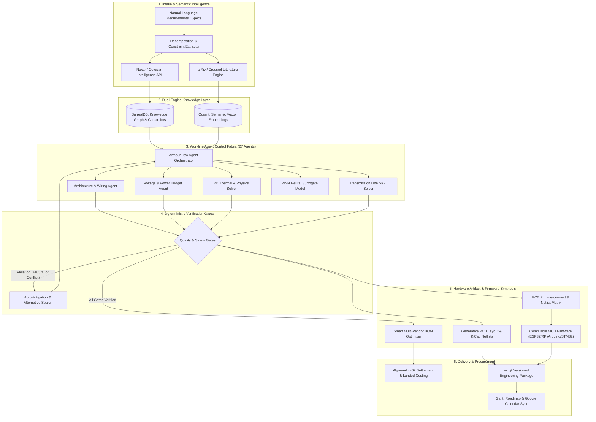

<div align="center">

# ⚡ WORKLINE
### Enterprise Autonomous Engineering Lifecycle Orchestration Platform

[](https://python.org)
[](https://fastapi.tiangolo.com)
[-black?logo=next.js&logoColor=white)](https://nextjs.org)
[](https://www.typescriptlang.org)
[](https://surrealdb.com)
[](https://qdrant.tech)
[](https://aws.amazon.com)
[](LICENSE)

<p align="center">
  <b>Workline</b> transforms natural-language system requirements into validated hardware specifications, multi-vendor optimized bills of materials (BOMs), physics-accurate simulations, cross-component PCB pin interconnects, compilable multi-platform microcontroller firmware, and fabrication-ready EDA artifacts.
</p>

[Architecture](#-system-architecture) •
[Key Features](#-core-capabilities) •
[Pinout & Firmware Engine](#-pcb-pin-interconnect--firmware-engine) •
[CLI Reference](#-canonical-command-line-interface-wline) •
[Getting Started](#-getting-started) •
[AWS Cloud Native](#-aws-cloud-native-deployment)

---

</div>

## 📌 Executive Summary

Modern hardware engineering is fragmented across disparate silos: schematic capture, distributor catalog queries, thermal/electrical physics simulations, microcontroller firmware authoring, and procurement logistics.

**Workline** solves this through a unified **Agent Control Fabric** powering **27 specialized Google ADK domain agents** across 90+ capabilities. It automates the hardware design loop through deterministic gatekeepers:
1. **Requirements Decomposition**: Translates plain text into structured mechanical, electrical, thermal, and regulatory constraints.
2. **Component Intelligence & Datasheet Grounding**: Direct live integration with **Octopart / Nexar APIs**, indexing verified MPNs, distributor stock, and technical datasheets.
3. **Scholarly Literature Retrieval**: Grounded in peer-reviewed science via **arXiv, Crossref, and Semantic Scholar**.
4. **Deterministic Validation**: Gatekeepers evaluate voltage rail sequencing, thermal derating (>105°C trip), and lifecycle obsolescence (PASS / FAIL / CONFLICT).
5. **PCB Pinout & Firmware Synthesis**: Dynamically maps electrical interconnects across all ICs and generates compilable code for **ESP32, Raspberry Pi, Arduino, and STM32**.
6. **Multi-Vendor Procurement**: Optimizes landed BOM costs (catalog base price + regional freight) with **Algorand x402** micro-settlement protocol integration.

---

## 🏛 System Architecture



---

## 🚀 Core Capabilities

### 1. Synchronized Dual-Tier BOM & Landed Costing Engine
- **Full Pricing Transparency**: Solves discrepancies between bare distributor catalog pricing and landed procurement budgets:
  - **Base Catalog Price**: Real-time ex-factory pricing from authorized distributors (element14, DigiKey, Mouser, Probots, Robu).
  - **Courier Logistics**: Calculates distance-based shipping and consolidation fees per vendor.
  - **Landed Cost**: Combined unit price with freight allocation, ensuring complete consistency across BOM and Component screens.
- **Alternative Component Search**: Evaluates pin-compatible, lower-cost, and high-availability drop-in substitutes.

### 2. PCB Pin Interconnect Matrix & KiCad Netlist Generator
- **Eliminates Blank Layout States**: Dynamically generates the exact pin-level wiring between all active project semiconductors (Microcontrollers, AFEs, Power Monitors, Transceivers, Regulators, and MOSFETs).
- **Protocol Bus Filtering**: One-click isolation of `I2C Bus (SDA/SCL)`, `CAN Bus (TX/RX/CANH/CANL)`, `Power Rails (3.3V/VBAT/GND)`, and `Safety Alerts/Gates`.
- **Export Formats**: Instant download of KiCad `.net` netlists and detailed `.csv` wiring schedules.

### 3. Multi-Platform Microcontroller Firmware Engine
- **Pin-Synchronized Firmware**: Generates production-ready code whose `#define` macros and peripheral pin assignments **strictly mirror** the PCB pinout matrix above.
- **Supported Platforms**:
  - ⚡ **ESP32**: C++ with Arduino Core / ESP-IDF (`Wire.h`, `driver/twai.h` CAN, hardware ISRs).
  - 🍓 **Raspberry Pi**: Python 3 (`smbus2`, `RPi.GPIO`, `python-can`).
  - ♾️ **Arduino**: C++ AVR (`Wire.h`, MCP2515 SPI CAN, external interrupts).
  - 🦾 **STM32**: C with STM32Cube HAL (`stm32f4xx_hal.h`, I2C1, CAN1, EXTI).
- **Peripheral Telemetry Routines**: Pre-configured registers for reading voltage/current (e.g. INA226 over 0x40), cell voltages (BQ76952 over 0x08), and broadcasting CAN frames at 500 kbps.

### 4. Deterministic Multi-Physics Simulation Suite
- **SPICE Electrical Solver**: Nodal matrix analysis verifying DC operating points, voltage drops, and transient responses.
- **2D Finite-Difference Thermal Solver**: Computes steady-state surface temperature profiles across copper pours and FR4 substrates.
- **Physics-Informed Neural Network (PINN)**: High-speed deep learning surrogate predicting hotspot thermal dissipation in milliseconds.
- **Safety Gate**: Automatically flags thermal risks if junctions exceed 105°C and suggests heatsink/copper pour mitigations.

### 5. Google Calendar & Gantt Roadmap Integration
- **Gantt Timeline**: Phase tracking, dependency lines, and milestone visualization across engineering sprints.
- **Google Calendar Export**: One-click schedule synchronization with Google Calendar via direct URL deep links and downloadable RFC 5545 `.ics` files.

---

## 🔌 PCB Pin Interconnect & Firmware Engine

Workline ensures that electrical hardware design and software firmware are generated from the **same deterministic source of truth**:

```
PCB Interconnect Netlist                      Microcontroller Firmware
────────────────────────                      ────────────────────────
U1 ESP32 Pin 15 (GPIO8)  ──[NET_I2C_SDA]──>  #define PIN_I2C_SDA  8   (Wire.begin)
U1 ESP32 Pin 16 (GPIO9)  ──[NET_I2C_SCL]──>  #define PIN_I2C_SCL  9   (Wire.begin)
U1 ESP32 Pin 11 (GPIO4)  ──[NET_CAN_TX]───>  #define PIN_TWAI_TX  4   (TWAI Driver)
U1 ESP32 Pin 12 (GPIO5)  ──[NET_CAN_RX]───>  #define PIN_TWAI_RX  5   (TWAI Driver)
U1 ESP32 Pin 13 (GPIO6)  ──[NET_BMS_ALERT]─>  #define PIN_ALERT    6   (attachInterrupt)
```

### Supported Microcontroller Families

| Platform | Language / Framework | Peripherals Configured | Code Features |
| :--- | :--- | :--- | :--- |
| **ESP32-S3** | C++ (Arduino / ESP-IDF) | I2C (400kHz), TWAI/CAN (500k), EXTI | Non-blocking telemetry loop, ISR handlers, CAN frame packing |
| **Raspberry Pi 4 / CM4** | Python 3 (`smbus2`, `RPi.GPIO`) | I2C1, GPIO Events, SocketCAN | Register reading classes, clean signal exits, logging |
| **Arduino Uno / Nano** | C++ (AVR Libc) | Wire (A4/A5), INT0/INT1, SPI | Memory-efficient fixed-point math, 115200 baud serial |
| **STM32F4 / G4** | C (STM32Cube HAL) | I2C1 (PB8/PB9), CAN1 (PA11/PA12), EXTI | Clock tree setup, NVIC interrupt priorities, Mailbox TX |

---

## 💻 Canonical Command Line Interface (`wline`)

Workline provides a powerful CLI (`wline`) for automated terminal workflows:

```bash
# Initialize workspace and verify environment
wline init
wline system health

# Project Lifecycle Management
wline project create "BMS-16S-Pro" --description "16S LiFePO4 battery management system"
wline project list
wline project open <project-id>

# Run Multi-Agent Engineering Workflows
wline workflow run pcb_end_to_end --project BMS-16S-Pro
wline task run --capability thermal_analysis --project BMS-16S-Pro
wline engineering optimize --project BMS-16S-Pro

# Hardware Pinout & PCB Generation
wline pcb create --width 100 --height 80 --project BMS-16S-Pro
wline pcb validate --project BMS-16S-Pro
wline pcb pinn train --epochs 50
wline pcb export --format kicad --project BMS-16S-Pro

# Literature & Document Synthesis
wline evidence search "BQ76952 I2C pullup requirements"
wline documents generate --type architecture_spec --project BMS-16S-Pro
wline security audit --project BMS-16S-Pro
```

---

## 🛠 Technology Stack

### Backend Core
- **Runtime**: Python 3.12+
- **API Framework**: FastAPI, Pydantic v2, Strawberry GraphQL
- **CLI Framework**: Typer, Rich formatting
- **Physics & Math**: NumPy, SciPy, PyTorch (PINN thermal model)
- **Agent Governance**: ArmorIQ SDK with HMAC cryptographic delegation

### Frontend Web Workbench
- **Framework**: Next.js 16.2 with Turbopack & App Router
- **UI Library**: React 19, Tailwind CSS v4, Lucide Icons, Framer Motion
- **Visualizations**: Recharts, SVG Board Canvas, Interactive Gantt Charts
- **Authentication**: Clerk JWT with dev-mode graceful bypass

### Databases & Cloud Storage
- **Relational & Graph Database**: **SurrealDB v2** (project entities, dependency graphs, pin nets)
- **Vector Database**: **Qdrant** (ANN semantic search over datasheets and research literature)
- **Local Fallback**: SQLite for offline idempotency and zero-credential environments
- **Object Storage**: Amazon S3 / Local Filesystem Artifact Store

---

## 📦 Getting Started

### Prerequisites
- **Python**: Version 3.12 or higher
- **Node.js**: Version 20.x or higher (`npm` or `pnpm`)
- **Git**

### 1. Clone the Repository
```bash
git clone https://github.com/callmetechnophile/workline.git
cd workline
```

### 2. Backend Setup
```bash
# Create and activate virtual environment
python -m venv .venv

# Windows PowerShell:
.\.venv\Scripts\Activate.ps1
# Linux / macOS:
source .venv/bin/activate

# Install dependencies
pip install -r requirements.txt

# Configure environment variables
cp .env.example .env
```

### 3. Frontend Setup
```bash
cd frontend
npm install
```

### 4. Running the Development Servers

**Start Backend (Port 8000):**
```bash
# From repository root with virtual environment activated:
python -m uvicorn backend.main:app --host 127.0.0.1 --port 8000 --reload
```

**Start Frontend (Port 3000):**
```bash
# In frontend directory:
npm run dev
```

Navigate to **`http://localhost:3000`** in your browser.

---

## ☁️ AWS Cloud-Native Deployment

Workline is architected for turnkey deployment to Amazon Web Services using **AWS SAM** and **Terraform**:

```
CloudFront CDN ──> API Gateway HTTP API ──> AWS Lambda (FastAPI / Mangum)
                                                ├── AWS Step Functions (27 Agents)
                                                ├── Amazon DynamoDB (State & Locks)
                                                ├── Amazon S3 (Artifacts & Gerbers)
                                                ├── Amazon SQS & DLQ (Asynchronous Jobs)
                                                └── Amazon EventBridge (Domain Events)
```

### Deployment Commands
```bash
# Build SAM application
sam build --template infra/aws/template.yaml

# Deploy to AWS environment
sam deploy --config-file infra/aws/samconfig.toml --config-env production
```

Detailed AWS documentation:
- [AWS_ARCHITECTURE.md](AWS_ARCHITECTURE.md) — Comprehensive infrastructure topology and networking.
- [AWS_DEPLOYMENT.md](AWS_DEPLOYMENT.md) — Step-by-step cloud provisioning and deployment guide.
- [DATABASE_ARCHITECTURE.md](DATABASE_ARCHITECTURE.md) — Multi-tier persistence specifications.
- [SECURITY.md](SECURITY.md) — Authentication, IAM least-privilege, and HMAC delegation models.

---

## 🧪 Testing & Verification

The repository includes a comprehensive, automated test suite covering all tiers:

```bash
# Run AWS migration and cloud subsystem tests
pytest tests/aws/test_aws_migration_suite.py -v

# Run canonical 27 agent execution tests
pytest tests/cli/test_canonical_27_agents.py -v

# Run CLI command test matrix (125 tests)
pytest tests/cli/ -v

# Run frontend build verification
cd frontend && npm run build
```

---

## 🛡 Security & Governance

- **Cryptographic Delegation**: Agent-to-agent tool executions generate HMAC-signed receipts (`parent_receipt_id`, `receipt_id`, `allowed_scope`).
- **3-Tier Action Boundaries**: Autonomous agents are restricted to *Recommendation* and *Proposal* scopes. Physical state mutations or order placements require explicit human-in-the-loop authorization.
- **Sensitive Data Scrubbing**: API credentials, authorization bearer headers, and private keys are scrubbed from telemetry logs.

---

## 📄 License

This project is licensed under the Apache License 2.0. See the [LICENSE](LICENSE) file for details.
