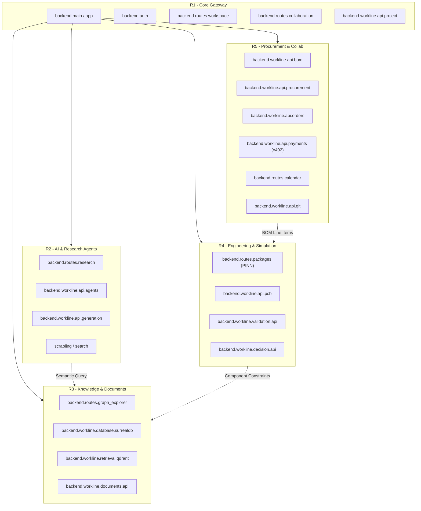

# Workline Backend Import Graph & Coupling Analysis

**Audit Date**: 2026-08-23  
**Modules Scanned**: 770 Python files across `backend/` and `cli/`

---

## 1. Domain Import Graph & Service Boundaries

---

## 2. Cross-Domain Coupling Findings

1. **Low-Coupling Periphery (R5 - Procurement & Orders)**:
   - `backend/workline/api/bom.py`, `backend/workline/api/procurement.py`, `backend/workline/api/orders.py`, and `backend/workline/api/payments.py` operate on self-contained schemas (`BOMItem`, `SupplierQuote`, `x402State`).
   - Zero dependencies on heavy ML or tensor libraries (`onnxruntime`, `torch`, `docling`).
   - **Extraction Risk**: **LOW**. Ideal candidate for first service extraction.

2. **Compute-Coupled Subsystems (R4 - Engineering vs R2 - AI)**:
   - R4 uses `numpy` for matrix transformations and derating equations.
   - R2 uses `google-genai`, `sarvamai`, and `scrapling` for prompt orchestration.
   - Both communicate through structured JSON contracts rather than shared in-memory object references.

3. **Shared Database Layer (R3 - Knowledge)**:
   - SurrealDB and Qdrant client connection managers are encapsulated within `backend/workline/database/surrealdb.py` and `backend/workline/retrieval/qdrant.py`.
   - Isolating R3 behind internal HTTP/gRPC endpoints allows other services to query knowledge graphs without directly managing database sockets.
