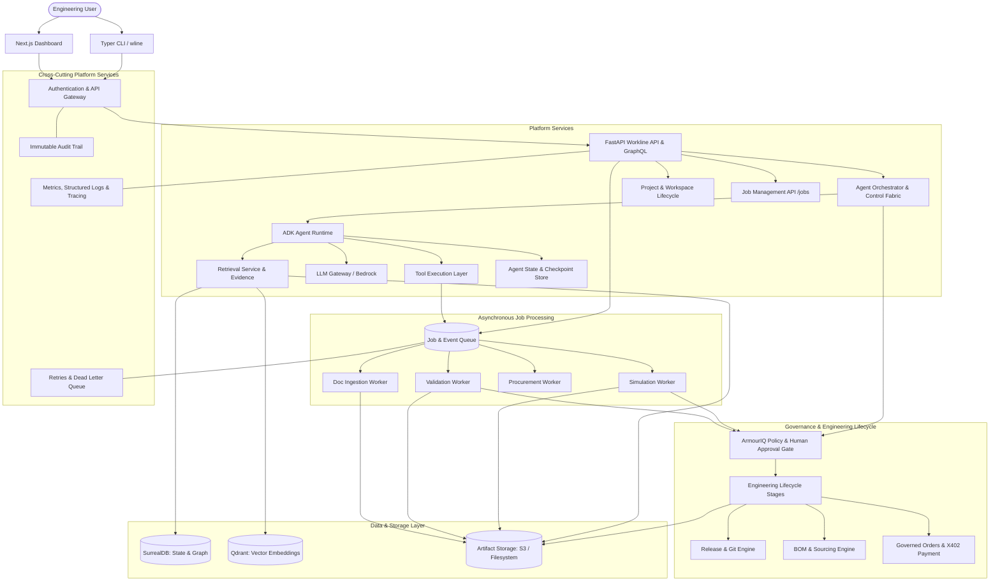

# Workline Platform Architecture — Target State

**Document Status:** Approved Architecture Plan  
**Target Platform:** Production-Ready Autonomous Cyber-Physical Engineering Automation  

---

## 1. High-Level Architectural Blueprint

---

## 2. Target Core Subsystems

### 2.1 Asynchronous Job & Event Queue (`backend/workline/jobs/`)
- **Queue Abstraction:** Pluggable `JobQueue` with memory/SQLite local development worker and queue backend.
- **States:** `PENDING`, `QUEUED`, `RUNNING`, `SUCCEEDED`, `FAILED`, `CANCELLED`, `RETRYING`.
- **Worker Pools:** Dedicated handlers for `SIMULATION`, `VALIDATION`, `PROCUREMENT`, `DOC_INGESTION`.
- **Reliability:** Exponential backoff retries, dead-letter storage, idempotency keys, and correlation ID propagation.

### 2.2 Persistent Agent Execution & Checkpoint State (`backend/workline/agent_state/`)
- Models: `AgentRun`, `AgentTask`, `ToolExecution`, `AgentCheckpoint`, `AgentDecision`.
- Full traceability of tool calls, inputs, outputs, timestamps, errors, and resumption checkpoints.
- Sanitized execution logs excluding credentials or raw secrets.

### 2.3 Decoupled Artifact Storage (`backend/workline/artifacts/`)
- Abstract interface: `ArtifactStore` with operations `put`, `get`, `delete`, `exists`, `metadata`, and `presign_url`.
- Local filesystem implementation (`FilesystemArtifactStore`) for development and testing.
- S3-compatible adapter (`S3ArtifactStore`) for production object storage.
- Separate metadata records (`ArtifactEntity`) tracking checksums, versions, MIME types, and creator identities.

### 2.4 Centralized LLM Gateway (`backend/workline/llm/`)
- Abstraction: `LLMGateway` supporting model routing, timeouts, retries, token accounting, and cost tracking.
- Providers:
  - `BedrockProvider`: Connects to AWS Bedrock runtime.
  - `LocalMockProvider`: Instant, deterministic offline mock responses for unit and local integration testing without AWS credentials.

### 2.5 Unified Retrieval & Evidence Service (`backend/workline/retrieval_service/`)
- Coordinates queries across Qdrant (semantic search), SurrealDB (relational knowledge graph), and Artifacts.
- Synthesizes an immutable `Evidence` object backing every agent decision and engineering milestone.

### 2.6 Hardened Governance, Security & Audit Trail (`backend/workline/security/`)
- Explicit RBAC roles: `ADMIN`, `ENGINEER`, `REVIEWER`, `PROCUREMENT`, `AGENT`.
- Separation of concerns:
  - `RECOMMENDATION`: Agent proposal with supporting evidence.
  - `AUTHORIZED ACTION`: Evaluated against policy and human sign-off.
  - `EXECUTED ACTION`: Dispatched to workers with signed audit event receipts.
- Immutable append-only audit event schema recording actor, resource, action, correlation ID, timestamp, and verdict.

### 2.7 Observability & Diagnostics (`backend/workline/observability/`)
- Structured JSON logging with request correlation IDs (`X-Correlation-ID`).
- In-memory and Prometheus-compatible metrics registry (request counts, latencies, job status counts, tool execution times).
- Health probes: `/health`, `/ready`, `/health/database`, `/health/cluster`.

---

## 3. Phased Implementation Roadmap

1. **Phase 1: Event & Job Architecture** (`backend/workline/jobs/`)
2. **Phase 2: Agent Execution State & Checkpoints** (`backend/workline/agent_state/`)
3. **Phase 3: Artifact Storage** (`backend/workline/artifacts/`)
4. **Phase 4: LLM Gateway** (`backend/workline/llm/`)
5. **Phase 5: Retrieval & Evidence Architecture** (`backend/workline/retrieval_service/`)
6. **Phase 6 & 7: Security Boundaries, RBAC & Audit Trail** (`backend/workline/security/`, `audit/`)
7. **Phase 8: Observability (Logs, Metrics, Health)** (`backend/workline/observability/`)
8. **Phase 9 & 10: Engineering Workflow Hardening & Governance Gating**
9. **Phase 11 & 12: Comprehensive Testing Suite & Failure Handling**
10. **Phase 13: Local Development Scripts & Docker Environment**
11. **Phase 14 & 15: Database Migrations & API Endpoints**
12. **Phase 16: Next.js Frontend Operational Visibility Views**
13. **Phase 17 & 18: Architecture Documentation & ADRs**
14. **Phase 19 & 20: Final Quality Review & Verification**
