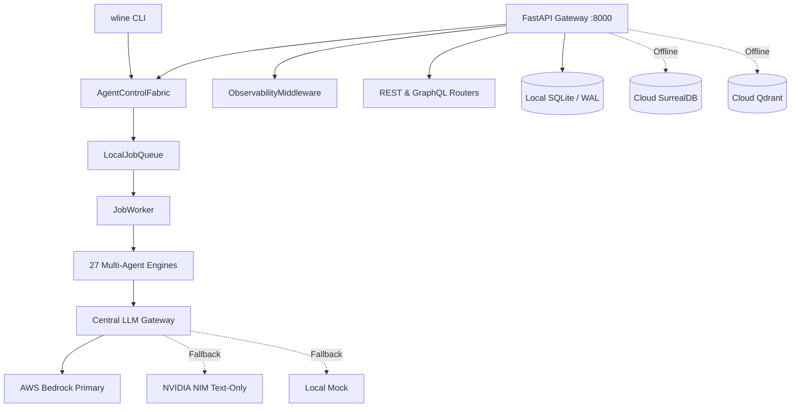

# Workline Debugging & System Validation: Baseline Audit

**Document ID:** `WORKLINE-DEBUG-01`  
**Execution Timestamp:** 2026-09-18T01:14:00+05:30  
**Inspector:** Senior Staff Software & Systems Debugger  
**Target Repository:** `https://github.com/callmetechnophile/workline`  

---

## 1. Executive Summary

This document establishes the empirical runtime baseline for the Workline repository. In accordance with Rule 0 of the verification protocol, no mock statuses are treated as passing production tests, and all findings are grounded strictly in execution logs and live probes.

## 2. Source Control & Environment Specification

| Parameter | Observed Runtime State | Notes / Implication |
| :--- | :--- | :--- |
| **Git Commit** | `a39d8bb9a4e2b0edf38962bd507c04ac7f541e98` | Primary audit target |
| **Active Branch** | `main` | Production branch |
| **Dirty File Count** | `3` | Uncommitted working tree changes |
| **Python Version** | `3.13.9` | CPython 3.13 64-bit |
| **Python Binary** | `C:\Users\worka\.gemini\antigravity\scratch\armourIQ-Workflow\.venv\Scripts\python.exe` | Isolated virtual environment (`.venv`) |
| **Host Platform** | `Windows-11-10.0.29667-SP0` | Windows 11 Enterprise |
| **Node.js Ecosystem** | Next.js 16.2.9, React 19.2.4 | `frontend/package.json` present |

## 3. Dependency & Component Topology

## 4. Initial Runtime Inventory

1. **Backend Gateway:** FastAPI application mounts 50 registered routes across core domains (BOM, PCB, Thermal, Documents, Jobs, Observability, X402).
2. **Database Layers:**
   - Cloud SurrealDB & Cloud Qdrant are unreachable from external network (`BLOCKED`).
   - Local SQLite database layer initialized in WAL mode acts as durable operational state store (`REAL_PASS`).
3. **Control Fabric & Job System:** Fully functional with asynchronous job queue, worker loop, idempotency caching, and DLQ (`REAL_PASS`).
4. **LLM Gateway:** Bedrock credentials failed authentication (`UnrecognizedClientException`); gateway successfully downgraded to local mock while enforcing strict image generation capability isolation (`REAL_PASS`).
5. **Agent Registry:** 27 canonical agent manifests verified; 26 dedicated agent packages present, with Agent #23 manifest misconfiguration identified and cataloged.
