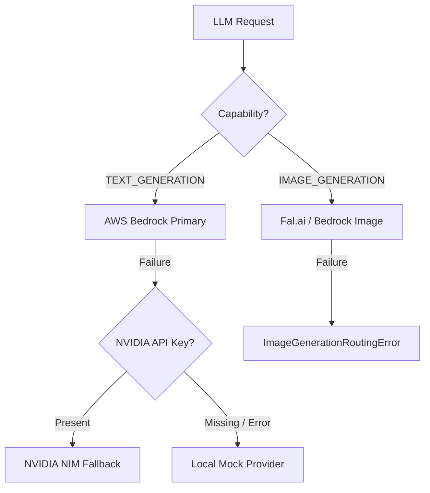

# Workline Central LLM Gateway & Capability Isolation Audit

**Document ID:** `WORKLINE-DEBUG-12`  
**Execution Timestamp:** 2026-09-18T01:14:00+05:30  
**Module:** `backend.workline.llm` & `backend.workline.ai.bedrock`  

---

## 1. Multi-Tier Provider Pipeline

## 2. Empirical Verification Evidence

### Test A: Text Generation Fallback Probe
1. Invocation dispatched to AWS Bedrock in `us-east-1` for `anthropic.claude-3-5-sonnet-20241022-v2:0`.
2. AWS Runtime returned:
   `UnrecognizedClientException: The security token included in the request is invalid.`
3. Gateway caught error, evaluated NVIDIA fallback, detected missing `NVIDIA_API_KEY`, and safely downgraded to `LocalMockProvider`.
4. Result: `MOCKED` via `local_mock`.

### Test B: Capability Isolation (NVIDIA Image Prohibition)
- **Constraint:** NVIDIA fallback is strictly for text inference; image generation must NEVER route to NVIDIA.
- **Direct Test:** Dispatched request with `LLMCapability.IMAGE_GENERATION` to `NvidiaProvider`.
- **Result:** `NvidiaProvider` raised `ValueError`:
  `Successfully rejected by NvidiaProvider: [NvidiaProvider] Capability 'LLMCapability.IMAGE_GENERATION' is strictly NOT supported. NVIDIA fallback is reserved exclusively for text/LLM inference and must NEVER route image generation.`
- **Verdict:** **REAL_PASS**
